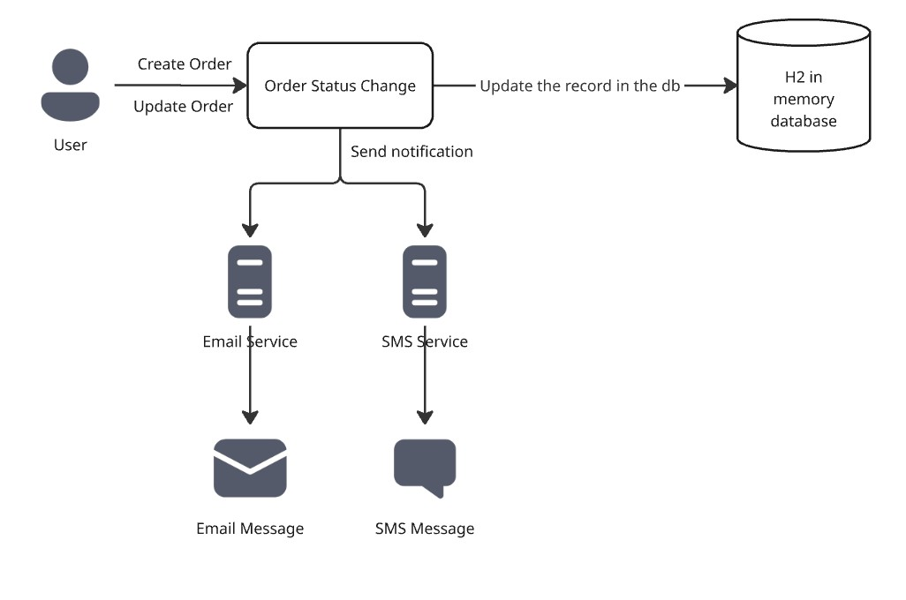

# order-processing-app

## Order Processing and Notification System
This project is a Spring Boot–based Order Processing System that exposes both REST APIs and a Web UI to manage orders.
It supports a controlled order lifecycle, role-based security, event-driven notifications, and extensible notification channels.

### Key design principles

- Single Service Layer used by both UI and REST controllers

- Separation of concerns (Controller ≠ Business Logic ≠ Integration)

- Event-driven notifications

- Configuration-driven channel enablement

- Consistent error handling

### Notification Overview

